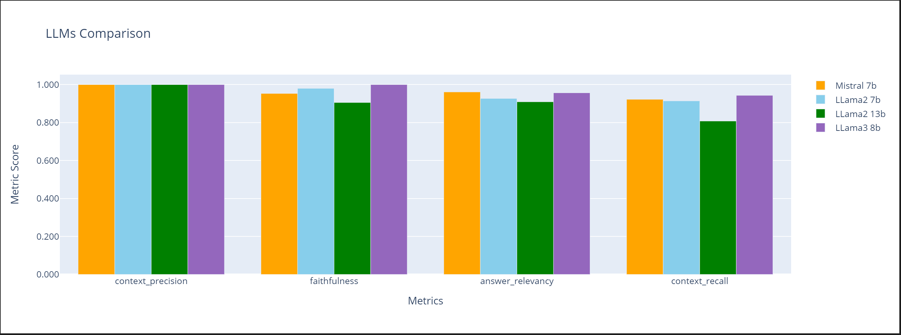

# Question Generation & Long Form Question Aswering RAG

## Project Workflow

## Evaluation Methodology
The journey of evaluating an LLM application ideally follows a structured framework, incorporating a suite of specialized tools and libraries. By systematically applying evaluation methods, we can gain meaningful insights into our applications, ensuring they meet our standards and deliver the desired outcomes.

## LLMs Throughput

## LLMs Evaluation

1. **Faithfulness** : Measures the factual consistency of the answer to the context based on the question.

2. **Context_precision** : Measures how relevant the retrieved context is to the question, conveying the quality of the retrieval pipeline.

3. **Answer_relevancy** : Measures how relevant the answer is to the question.

4. **Context_recall** : Measures the retriever’s ability to retrieve all necessary information required to answer the question.
