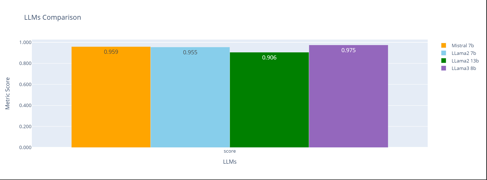

# Question Generation & Long Form Question Aswering RAG

## Project Workflow


## Evaluation Methodology
The journey of evaluating an LLM application ideally follows a structured framework, incorporating a suite of specialized tools and libraries. By systematically applying evaluation methods, we can gain meaningful insights into our applications, ensuring they meet our standards and deliver the desired outcomes.


## LLMs Throughput


## LLMs Evaluation


1. **Faithfulness** : Measures the factual consistency of the answer to the context based on the question.

2. **Context_precision** : Measures how relevant the retrieved context is to the question, conveying the quality of the retrieval pipeline.

3. **Answer_relevancy** : Measures how relevant the answer is to the question.

4. **Context_recall** : Measures the retriever’s ability to retrieve all necessary information required to answer the question.

## LLMs Evaluation Final Score


## How to install

There are two main parts for this projet, the first one is our fine-tuned LLM model, the second one is the ai avatar.

To configure the model please follow the steps below:

1. Create a virtual env and install packages.
    ```bash
    cd model
    python3 -m venv .venv
    pip install -r requirements.txt
    ```

2. Install ollama from [here](https://ollama.com/download).
3. Run weaviate vector database using docker compose file.
    ```bash
    docker compose up -d
    ```

4. Fine-tune your llm model using **Modelfile**.
    ```bash
    ollama create question-answering -f Modelfile
    ```
5. Test the model.


<hr>

Before using this system, ensure you have the following prerequisites:

1. **OpenAI Subscription:** You must have an active subscription with OpenAI. If you don't have one, you can create it [here](https://openai.com/product).
2. **Eleven Labs Subscription:** You need to have a subscription with Eleven Labs. If you don't have one yet, you can sign up [here](https://elevenlabs.io/).
3. **Rhubarb Lip-Sync:** Download the latest version of Rhubarb Lip-Sync compatible with your operating system from the official [Rhubarb Lip-Sync repository](https://github.com/DanielSWolf/rhubarb-lip-sync/releases). Once downloaded, create a `/bin` directory in the backend and move all the contents of the unzipped `rhubarb-lip-sync.zip` into it.

To configure the avatar follow the following steps:

1. Navigate to the project directory `npc-avatar`:

```bash
cd npc-avatar
```

2. Install dependencies for monorepo:
```bash
yarn
```
3. Create a .env file in the root `/apps/backend/` of the project and add the following environment variables:

```bash
# OPENAI
OPENAI_MODEL=<YOUR_GPT_MODEL>
OPENAI_API_KEY=<YOUR_OPENAI_API_KEY>

# Elevenlabs
ELEVEN_LABS_API_KEY=<YOUR_ELEVEN_LABS_API_KEY>
ELVEN_LABS_VOICE_ID=<YOUR_ELEVEN_LABS_VOICE_ID>
ELEVEN_LABS_MODEL_ID=<YOUR_ELEVEN_LABS_MODEL_ID>
```

4. Run the development system:

```bash
yarn dev
```

5. If you need install another dependence in the monorepo, you can do this:

```bash
yarn add --dev -W <PACKAGE_NAME>
yarn
```

Open [http://localhost:5173/](http://localhost:5173/) with your browser to see the result.

If everthing is configured succesfully you'll see our avatar:


